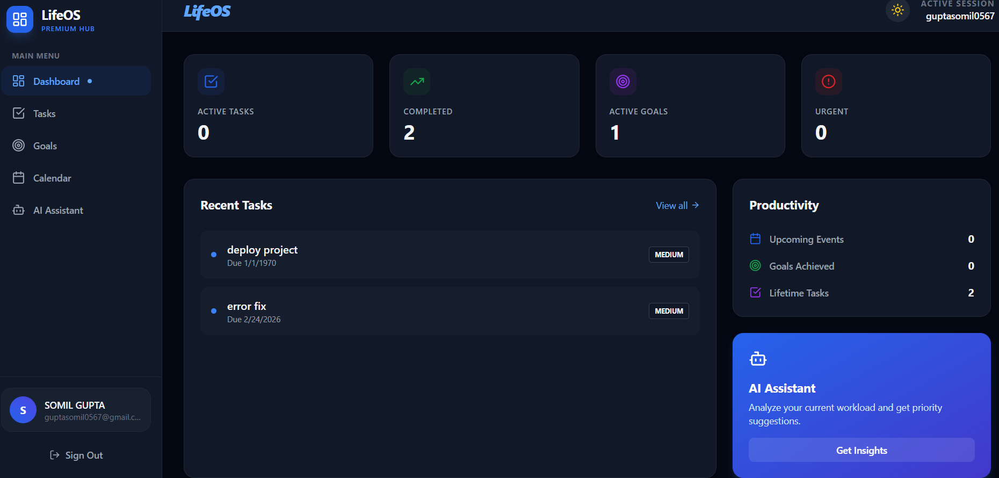
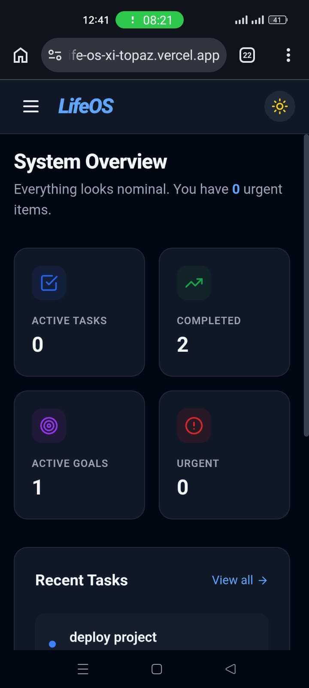
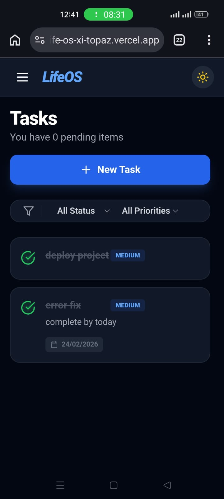
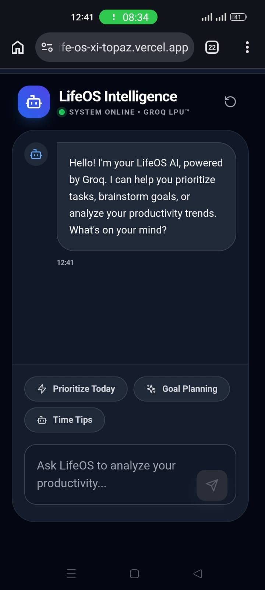

# 🚀 LifeOS – AI Powered Personal Productivity System

LifeOS is a **full-stack productivity platform** designed to help users manage **tasks, goals, events, and personal productivity analytics** in one place.

The application integrates an **AI assistant powered by the Groq API** to provide intelligent task prioritization and productivity insights.

This project demonstrates **full-stack development using the MERN ecosystem, modern UI design, secure authentication, and AI integration.**

---

# 🌐 Live Demo

**Frontend (Vercel)**  
https://life-6hl26xlns-guptasomil0567-7720s-projects.vercel.app/

**Backend API (Render)**  
https://lifeos-5ndi.onrender.com

---

# 📸 Screenshots

## 💻 Desktop View



The desktop dashboard provides an overview of tasks, goals, analytics, and upcoming events in a clean and modern interface.

---

## 📱 Mobile View

| Dashboard | Tasks | AI Assistant |
|-----------|------|-------------|
|  |  |  |

---

# ✨ Key Features

## 📝 Task Management

- Create, edit, and delete tasks  
- Task priority levels (**Low, Medium, High, Urgent**)  
- Status tracking (**Todo, In-Progress, Completed**)  
- Task filtering and tagging  
- Due date management  

---

## 🎯 Goal Tracking

- Create long-term and short-term goals  
- Add milestones for each goal  
- Track goal progress visually  
- Update milestone completion  

---

## 📅 Calendar & Events

- Schedule and manage events  
- Monthly calendar interface  
- Event categorization  

---

## 🤖 AI Assistant

Powered by **Groq API**

Capabilities include:

- Task prioritization suggestions  
- Productivity insights  
- Goal planning assistance  
- Natural language productivity queries  

---

## 📊 Analytics Dashboard

- Task completion statistics  
- Active goals overview  
- Upcoming events  
- Productivity insights  

---

## 🔐 Secure Authentication

- JWT based authentication  
- Password hashing using **bcrypt**  
- Protected API routes  
- User profile management  

---

# 🛠 Tech Stack

## Frontend

- React 18  
- TypeScript  
- Vite  
- Tailwind CSS  
- Lucide React Icons  
- Context API  

---

## Backend

- Node.js  
- Express.js  
- MongoDB  
- Mongoose  
- JWT Authentication  
- Groq AI SDK  

---

## Deployment

- **Frontend:** Vercel  
- **Backend:** Render  
- **Database:** MongoDB Atlas  

---

# 🏗 Project Architecture

```
Client (React + Vite)
        │
        │ REST API
        ▼
Backend (Node.js + Express)
        │
        ▼
MongoDB Atlas Database
        │
        ▼
Groq AI API
```

---

# 📂 Project Structure

```
lifeos
│
├── src
│   ├── components
│   │   ├── AI
│   │   ├── Auth
│   │   ├── Calendar
│   │   ├── Dashboard
│   │   ├── Goals
│   │   ├── Layout
│   │   └── Tasks
│   │
│   ├── contexts
│   ├── services
│   ├── App.tsx
│   └── main.tsx
│
├── server
│   ├── config
│   ├── controllers
│   ├── middleware
│   ├── models
│   ├── routes
│   └── server.js
```

---

# ⚙️ Installation

## 1️⃣ Clone the Repository

```bash
git clone https://github.com/Somilgupta07/LifeOs.git
cd lifeos
```

---

## 2️⃣ Install Dependencies

### Frontend

```bash
npm install
```

### Backend

```bash
cd server
npm install
cd ..
```

---

# 🔑 Environment Variables

Create **.env** in the root folder:

```
VITE_API_URL=http://localhost:5000/api
```

Create **server/.env**

```
PORT=5000
MONGODB_URI=your_mongodb_connection_string
JWT_SECRET=your_secret_key
GROQ_API_KEY=your_groq_api_key
FRONTEND_URL=http://localhost:5173
```

---

# ▶️ Running the Project

### Start Backend

```bash
cd server
npm run dev
```

### Start Frontend

```bash
npm run dev
```

Application will run on:

**Frontend**  
http://localhost:5173

**Backend**  
http://localhost:5000/api

---

# 🚀 Deployment

**Frontend**  
Deployed using **Vercel**

**Backend**  
Deployed using **Render**

**Database**  
Hosted on **MongoDB Atlas**

---

# 📈 Future Improvements

- Drag and drop task management  
- Productivity notifications  
- Habit tracking  
- Mobile application  

---

# 👨‍💻 Author

**Somil Gupta**

GitHub  
https://github.com/Somilgupta07

---

# ⭐ Support

If you found this project helpful, please give it a **star ⭐ on GitHub**.
